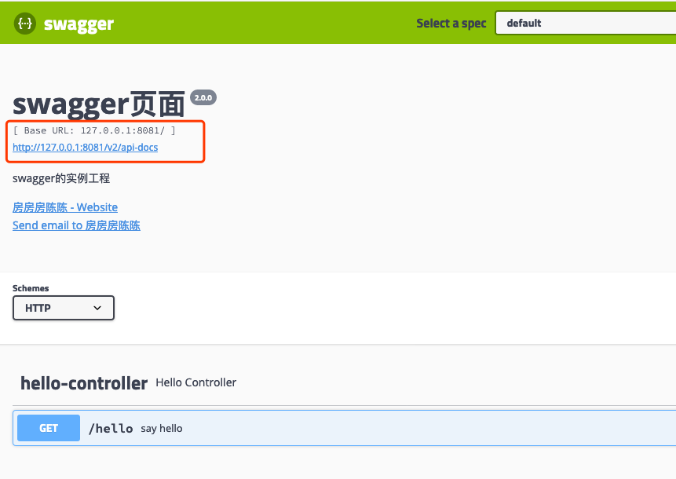
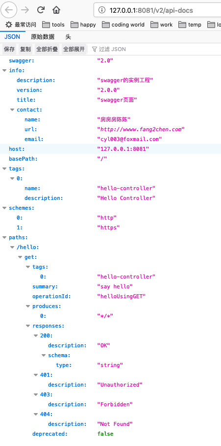

[TOC]


# `swagger`

`swagger`的目的就是为了管理服务器端的`API`接口文档

- swagger-ui：接口调试
- swagger-codegen：`ApiClient`的生成


# `swagger-ui`

## 基本配置

这里只讲解 `spring boot` 项目如何集成 `swagger-ui`

引入`pom`依赖

```xml
<properties>
  <java.version>1.8</java.version>
  <swagger.version>2.9.2</swagger.version>
  <swagger.annotations.version>1.5.15</swagger.annotations.version>
</properties>

<dependency>
  <groupId>io.springfox</groupId>
  <artifactId>springfox-swagger2</artifactId>
  <version>${swagger.version}</version>
</dependency>
<dependency>
  <groupId>io.springfox</groupId>
  <artifactId>springfox-swagger-ui</artifactId>
  <version>${swagger.version}</version>
</dependency>
<dependency>
  <groupId>io.swagger</groupId>
  <artifactId>swagger-annotations</artifactId>
  <version>${swagger.annotations.version}</version>
</dependency>
```


创建一个`swagger`的配置参数类

```java
/**
 * <p>
 *     swagger 配置类
 * </p>
 * @author yuanliang.chen
 * @date 2019/9/25
 */
@ConfigurationProperties(prefix = "swagger.person")
@Data
public class SwaggerProperties {

    /**
     * 进行扫描的包
     * 如果不写的话就是扫描当前包及其子包
     * */
    private List<String> basePackage;

    /**
     * ui的题目
     * */
    private String title = "swagger-ui";

    /**
     * 版本
     * */
    private String version = "1.0.0";

    /**
     * 协议
     * */
    private List<String> protocols = Arrays.asList("http");

    /**
     * host也就是页面上发起请求的时候填写的地址
     * */
    private String host;

    /**
     * 联系人
     * */
    private String contactName;

    /**
     * 联系url
     * */
    private String contactUrl;

    /**
     * 联系用email
     * */
    private String contactEmail;

    /**
     * 描述信息
     * */
    private String description;

}
```


配置对应的`Configuration`类

```java
@Configuration
@EnableConfigurationProperties(SwaggerProperties.class)
@EnableSwagger2
@Slf4j
public class SwaggerConfiguration {
  
    @Autowired
    private SwaggerProperties swaggerProperties;

    /**
     * 创建API应用
     * apiInfo() 增加API相关信息
     * 通过select()函数返回一个ApiSelectorBuilder实例,用来控制哪些接口暴露给Swagger来展现，
     * 指定扫描的包路径来定义指定要建立API的目录。
     * */
    @Bean
    public Docket createRestApi() {

        Docket docket = new Docket(DocumentationType.SWAGGER_2);
        docket.protocols(new HashSet<>(swaggerProperties.getProtocols()));
        docket.apiInfo(apiInfo());
        docket.enable(true);
        docket.host(swaggerProperties.getHost());
        ApiSelectorBuilder apiSelectorBuilder = docket.select();
        apiSelectorBuilder.apis(basePackage(swaggerProperties.getBasePackage()));
        apiSelectorBuilder.paths(PathSelectors.any());
        docket = apiSelectorBuilder.build();

        return docket;

    }

    /**
     * 创建该API的基本信息（这些基本信息会展现在文档页面中）
     * @return ApiInfo
     */
    private ApiInfo apiInfo() {
        return new ApiInfoBuilder()
                .title(swaggerProperties.getTitle())
                .description(swaggerProperties.getDescription())
                .contact(
                        new Contact(swaggerProperties.getContactName(),
                                swaggerProperties.getContactUrl(),
                                swaggerProperties.getContactEmail()))
                .version(swaggerProperties.getVersion())
                .build();
    }

    /**
     * <p>
     *     生成扫描规则
     * </p>
     * @param basePackageList : 需要进行扫描的包列表
     * @return : Predicate<RequestHandler>
     */
    public static Predicate<RequestHandler> basePackage(final List<String> basePackageList) {
        return predicate -> declaringClass(predicate).transform(handlerPackage(basePackageList)).or(true);
    }

    private static Function<Class<?>, Boolean> handlerPackage(final List<String> basePackageList)     {
        return input -> {
            // 循环判断匹配
            for (String strPackage : basePackageList) {
                boolean isMatch = input.getPackage().getName().startsWith(strPackage);
                if (isMatch) {
                    return true;
                }
            }
            return false;
        };
    }

    private static Optional<? extends Class<?>> declaringClass(RequestHandler input) {
        return Optional.fromNullable(input.declaringClass());
    }
}
```


配置文件中增加配置

```yaml
server:
  port: 8081

swagger:
  person:
    basePackage:
    - com.fang2chen.spring.study.swagger.controller
    title: swagger页面
    version: 2.0.0
    protocols:
    - http
    - https
    host: 127.0.0.1:8081
    contactName: 房房房陈陈
    contactUrl: http://wwww.fang2chen.com
    contactEmail: cyl003@foxmail.com
    description: swagger的实例工程
```


然后我们访问`http://127.0.0.1:8081/swagger-ui.html`，可以看到ui界面了（`2.8.+`  的页面不是很喜欢，但功能比`2.6.+` 的多，忍着吧）




红框中的就是`swagger`中最重要的一个`api-docs`，它描述了关于服务 `API` 的所有信息




## 修改 `api-docs` 的路径

有的时候我们为了路由或者权限的问题需要修改`api-docs`的访问路径。但这里最重要的不是修改的这个配置，最重要的是如何找到这个配置。

首先是查看`@EnableSwagger2`注解的源码。

```java
@Retention(RetentionPolicy.RUNTIME)
@Target({ElementType.TYPE})
@Documented
@Import({Swagger2DocumentationConfiguration.class})
public @interface EnableSwagger2 {
}
```


它手动`Import`了`Swagger2DocumentationConfiguration.class`类，然后我们看一下它的源码。

```java
@Configuration
@Import({SpringfoxWebMvcConfiguration.class, SwaggerCommonConfiguration.class})
@ComponentScan(
    basePackages = {"springfox.documentation.swagger2.mappers"}
)
@ConditionalOnWebApplication
public class Swagger2DocumentationConfiguration {
    public Swagger2DocumentationConfiguration() {
    }

    @Bean
    public JacksonModuleRegistrar swagger2Module() {
        return new Swagger2JacksonModule();
    }

    @Bean
    public HandlerMapping swagger2ControllerMapping(Environment environment, DocumentationCache documentationCache, ServiceModelToSwagger2Mapper mapper, JsonSerializer jsonSerializer) {
        return new PropertySourcedRequestMappingHandlerMapping(environment, new Swagger2Controller(environment, documentationCache, mapper, jsonSerializer));
    }
}
```


其中重要的就是`Swagger2Controller`类了，它提供了访问`api-docs`的`API`

```java
@Controller
@ApiIgnore
public class Swagger2Controller {

  public static final String DEFAULT_URL = "/v2/api-docs";
  private static final Logger LOGGER = LoggerFactory.getLogger(Swagger2Controller.class);
  private static final String HAL_MEDIA_TYPE = "application/hal+json";

  private final String hostNameOverride;
  private final DocumentationCache documentationCache;
  private final ServiceModelToSwagger2Mapper mapper;
  private final JsonSerializer jsonSerializer;

  @Autowired
  public Swagger2Controller(
      Environment environment,
      DocumentationCache documentationCache,
      ServiceModelToSwagger2Mapper mapper,
      JsonSerializer jsonSerializer) {

    this.hostNameOverride =
        environment.getProperty(
            "springfox.documentation.swagger.v2.host",
            "DEFAULT");
    this.documentationCache = documentationCache;
    this.mapper = mapper;
    this.jsonSerializer = jsonSerializer;
  }

  @RequestMapping(
      value = DEFAULT_URL,
      method = RequestMethod.GET,
      produces = { APPLICATION_JSON_VALUE, HAL_MEDIA_TYPE })
  @PropertySourcedMapping(
      value = "${springfox.documentation.swagger.v2.path}",
      propertyKey = "springfox.documentation.swagger.v2.path")
  @ResponseBody
  public ResponseEntity<Json> getDocumentation(
      @RequestParam(value = "group", required = false) String swaggerGroup,
      HttpServletRequest servletRequest) {
    ...
  }
}
```

`API`方法上的`@RequestMapping` 和 `@PropertySourcedMapping` 注解就规定了其访问路径。

其实到这一步我们就可以得出`springfox.documentation.swagger.v2.path` 可以修改`api-docs`的访问路径了。

至于`@PropertySourcedMapping`是如何起作用的就需要看`PropertySourcedRequestMappingHandlerMapping`的源码了，现在就不做深入的讲解了。


上面将的是`2.9.2`版本的，我们把版本切换到`2.6.1`版本，再看`Swagger2Controller`的源码。它的实现方法就比较简单粗暴了。

```java
@ApiIgnore
@RequestMapping(
  value = {"${springfox.documentation.swagger.v2.path:/v2/api-docs}"},
  method = {RequestMethod.GET},
  produces = {"application/json", "application/hal+json"}
)
@ResponseBody
```


所以如果我们想让`API`接口的路径由配置文件决定的话：

- `@RequestMapping`上直接写 `SpEL` 表达式
- 为自己的`API` 生成一个 `HandlerMapping`  `Bean`


# swagger-codegen

其最终的目的就是根据服务器 `api-docs` 生成个亿调用服务器的函数代码。


根据`api-docs` 生成 `api client` 的代码。

获取到`api-docs` 并储存到文件中。

然后创建一个 `maven` 项目并定制 `pom`

```xml
<?xml version="1.0" encoding="UTF-8"?>
<project xmlns="http://maven.apache.org/POM/4.0.0" xmlns:xsi="http://www.w3.org/2001/XMLSchema-instance" xsi:schemaLocation="http://maven.apache.org/POM/4.0.0 http://maven.apache.org/xsd/maven-4.0.0.xsd">
    <parent>
        <artifactId>example-istio-ecu</artifactId>
        <groupId>com.XXXX.istio.platform</groupId>
        <version>1.0.0-SNAPSHOT</version>
        <relativePath>../pom.xml</relativePath>
    </parent>
    <modelVersion>4.0.0</modelVersion>

    <artifactId>example-istio-ecu-client</artifactId>
    <version>1.0.1-SNAPSHOT</version>

    <dependencies>
        <dependency>
            <groupId>io.swagger</groupId>
            <artifactId>swagger-annotations</artifactId>
        </dependency>
        <dependency>
            <groupId>com.squareup.okhttp</groupId>
            <artifactId>okhttp</artifactId>
        </dependency>
        <dependency>
            <groupId>com.squareup.okhttp</groupId>
            <artifactId>logging-interceptor</artifactId>
        </dependency>
        <dependency>
            <groupId>com.google.code.gson</groupId>
            <artifactId>gson</artifactId>
        </dependency>
        <dependency>
            <groupId>io.gsonfire</groupId>
            <artifactId>gson-fire</artifactId>
        </dependency>
        <dependency>
            <groupId>org.threeten</groupId>
            <artifactId>threetenbp</artifactId>
        </dependency>
        <!-- test dependencies -->
        <dependency>
            <groupId>junit</groupId>
            <artifactId>junit</artifactId>
            <scope>test</scope>
        </dependency>
        <dependency>
            <groupId>io.swagger</groupId>
            <artifactId>swagger-annotations</artifactId>
        </dependency>
        <dependency>
            <groupId>io.springfox</groupId>
            <artifactId>springfox-swagger2</artifactId>
        </dependency>
        <dependency>
            <groupId>io.springfox</groupId>
            <artifactId>springfox-swagger-ui</artifactId>
        </dependency>
        <dependency>
            <groupId>joda-time</groupId>
            <artifactId>joda-time</artifactId>
        </dependency>
        <dependency>
            <groupId>org.springframework.boot</groupId>
            <artifactId>spring-boot-starter-web</artifactId>
        </dependency>
    </dependencies>

    <properties>
        <client-base-package-path>com.uaescloud.istio.platform.example.istio.ecu.client</client-base-package-path>
        <client-docs-path>${project.basedir}/apiJson/api-docs.json</client-docs-path>
    </properties>

    <build>
        <plugins>
            <plugin>
                <groupId>io.swagger</groupId>
                <artifactId>swagger-codegen-maven-plugin</artifactId>
                <version>2.3.1</version>
                <configuration>
                    <inputSpec>${client-docs-path}</inputSpec>
                    <language>java</language>
                    <output>${project.basedir}</output>
                    <apiPackage>${client-base-package-path}.client</apiPackage>
                    <modelPackage>${client-base-package-path}.model</modelPackage>
                    <configOptions>
                        <sourceFolder>src/main/java</sourceFolder>
                        <dateLibrary>legacy</dateLibrary>
                        <library>resttemplate</library>
                    </configOptions>
                </configuration>
                <executions>
                    <execution>
                        <phase>none</phase>
                    </execution>
                </executions>
            </plugin>
        </plugins>
    </build>
</project>
```

这是我贴的其他项目的 `api-client` 的pom 文件， 其中 `swagger-codegen-maven-plugin` 就是打包生成插件了。

需要注意几个参数的含义：

- `inputSpec` ：也就是 `api-docs` 的路径， 可以是一个 文件目录，也可以是一个URL
- `language`：需要生成的语言，目前只用过`java`的，其实还有很多，`js`、`go` 啥的都有
- `output`：生成羡慕的出书路径
- `apiPackage`：`api` 接口的类的包名
- `modelPackage`： 模型类的包名
- `configOptions`：附加的配置项， 这个项目里的内容是用来配置生成规则的，可以使用 `java -jar swagger-codegen-cli-2.3.1.jar config-help -l java` 来查看
  - `sourceFolder` ： 源码目录
  - `dataLibaray`： 使用何种时间处理对象来处理时间属性。
  - `library`: 使用何种框架来生成。
    - `resttemplate` ： 也就是 `RestTemplate + Jackson`


关于使用方法就不多说了， 生成的 `README.md` 中会有非常详细的说明。